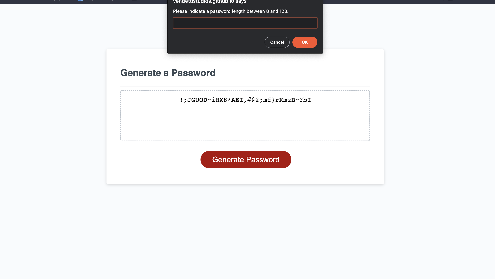

# generating-a-password-is-fun

​
## Table of contents
​
- [Overview](#overview)
  - [The challenge](#the-challenge)
  - [User Story](#user-story)
  - [Acceptance Criteria](#acceptance-criteria)
  - [Screenshot](#screenshot)
  - [Links](#links)
- [My process](#my-process)
  - [Built with](#built-with)
  - [Useful resources](#useful-resources)
- [Author](#author)
- [Acknowledgments](#acknowledgments)

## Overview
​
### The challenge
​
Create an application that an employee can use to generate a random password based on criteria they've selected. This app will run in the browser, and will feature dynamically updated HTML and CSS powered by JavaScript code that you write. It will have a clean and polished user interface that is responsive, ensuring that it adapts to multiple screen sizes.
​
### User Story
​
AS AN employee with access to sensitive data
I WANT to randomly generate a password that meets certain criteria
SO THAT I can create a strong password that provides greater security
​
### Acceptance Criteria
​
GIVEN I need a new, secure password
WHEN I click the button to generate a password
THEN I am presented with a series of prompts for password criteria
WHEN prompted for password criteria
THEN I select which criteria to include in the password
WHEN prompted for the length of the password
THEN I choose a length of at least 8 characters and no more than 128 characters
WHEN asked for character types to include in the password
THEN I confirm whether or not to include lowercase, uppercase, numeric, and/or special characters
WHEN I answer each prompt
THEN my input should be validated and at least one character type should be selected
WHEN all prompts are answered
THEN a password is generated that matches the selected criteria
WHEN the password is generated
THEN the password is either displayed in an alert or written to the page
​
### Screenshot
​

​
​
### Links
​
- Live Site URL: [https://vendettistudios.github.io/generating-a-password-is-fun/](https://vendettistudios.github.io/generating-a-password-is-fun/)
- Solution URL: https://github.com/VendettiStudios/generating-a-password-is-fun
​
## My process
​
### Built with
​
- Semantic HTML5 markup
- CSS
-JavaScript
​
### Useful resources
​
- [Owasp.org](https://owasp.org/www-community/password-special-characters) - 
​

## Author
​
[Daniel Holloway](https://danielholloway.dev)
